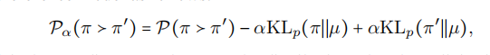

## paper
### Multi-turn Reinforcement Learning from Preference Human Feedback
#### 陌生算法
1. Bradely-Terry model ： 理解为一种对比的模型
2. Mirror Descent 镜像下降，一种凸优化算法
3. Nash-MD算法: 不通过对比，而是直接进行偏好学习的一种算法 https://arxiv.org/abs/2312.00886
#### preliminary
1. 文中CMDP定义:

总结 C: 上下文空间
Y: 状态空间
X: 动作空间
H: 视野空间
2. horizon: 可以抽象地理解为agent的生存时间，也即他可以采取的步数总数。
3. Nash equilibrium:多方都无法再通过更改策略来增大获益的均衡状态
#### 正文内容
##### 针对multi-turn的一些解释
1. 模型的数学表达（最大化还是要最小化?）

2. 针对每一步都进行reward而不是针对整体进行reward的话是有偏的
##### 算法介绍
1. Q-function 定义(?)

2. MTPO的pipline(这和single turn有什么区别)
从context pool中sample -> 用现有策略跑出两条trajectory -> 将两条的结果(状态)输入到用offline的偏好数据训练的偏好模型(打分模型)中 -> 进行偏好训练（具体训练方式?）
##### 实验设置
1. 初始数据生成: 设置一些story-line让GPT生成完整对话作为数据集
2. 利用生成的数据fine-tune两个小模型，一个用作agent，一个用于环境。（using teacher forcing?）
3. 偏好数据生成: 让两个小模型对话产生数据，然后对这个数据做标注(打分)
##### 实验场景
1. Education Dialogue

## code
### pdb
在想要打断点的地方写
```python
    import pdb 
    pdb.set_trace()
```

### hack第三方库
本质上是利用继承的重写覆盖能力来完成对于第三方库中函数的重写。