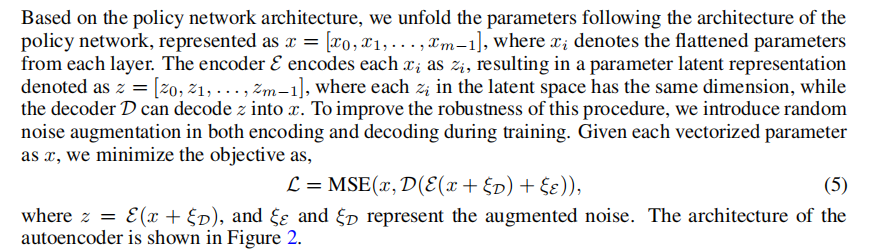
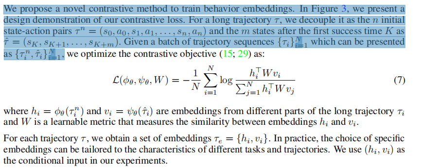
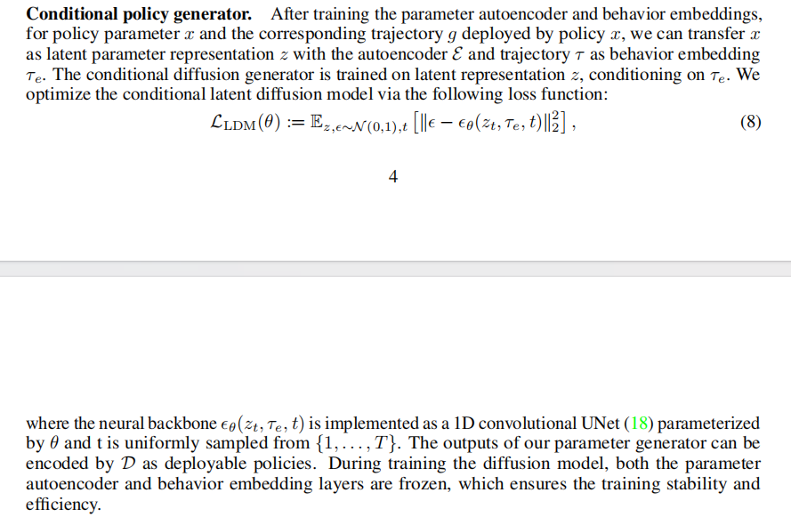

# paper 
## Make-An-Agent
### 灵感来源
diffusion model在文生图和文生视频领域取得了很好的效果,试着考虑把策略网络的产生也抽象成一个去噪的过程. 是一种hypernetwork的延伸，并希望通过此方法,实现只使用一个trajectory还原出parameters

### 知识
1. behavior embdding
行为嵌入实际上是将一系列复杂的行为模式压缩成一种简洁的表示形式，这种表示形式不仅包含了环境的动态信息，还包含了与任务目标相关的关键信息。通过学习前n步轨迹和后续成功状态之间的互信息，我们能够提取出行为模式中的关键特征，使得策略能够更有效地利用这些特征进行决策和规划。
这样的方法可以使得策略在面对不同的环境和任务目标时，更加灵活和高效，因为它能够利用行为嵌入中提取出的关键信息，从而生成更加适应环境和任务需求的策略参数。

### 一些术语
1. latent representation 
是一个类似于特征提取的概念
2. seen task 和 unseen task 即模型训练时有没有训练过的任务,可以体现出模型对于任务种类的泛化能力

### Method

#### parameter representation
本质上是将网络的参数做一个压缩(类似于CNN的池化操作),下为论文中的具体实现方法.

#### Behavior embedding

本篇论文采用的具体方法为考虑前n步和成功信号之后K步之间的关系,来进行特征提取的

#### flexibility

#### diffusion model 训练

# code

1. montecarlo数据集收一下,准备开始DPO

2. 在使用batch之前需要考虑GPU的存量