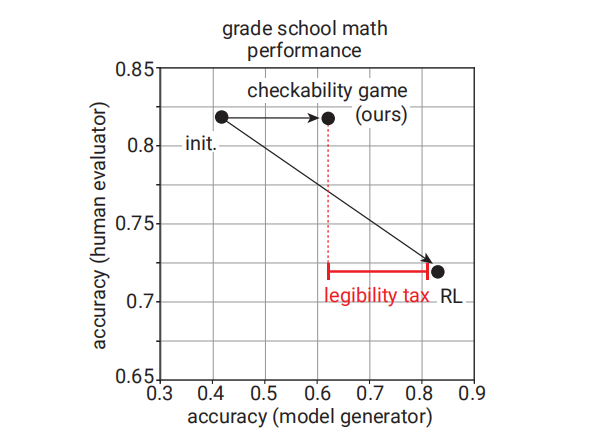

# paper

## DATA-JUICER SANDBOX: A COMPREHENSIVE SUITE FOR MULTIMODAL DATA-MODEL CO-DEVELOPMENT

### 知识
1. LLaVM-like model
LLaVA stands for Large Language and Vision Assistant. LLaVA-like models are multimodal models that combine language understanding and generation capabilities with visual information processing. 
2. Dit-based model
DiT stands for Discrete Image Transformer. DiT-based models are focused on processing and understanding visual information using transformer architectures. These models apply transformer techniques, originally designed for sequential data like text, to image data.
3. scaling laws?
4. data-model co-development的概念是由于如果单独以某一个为中心分别发展的话,会出现不fit的情况
### 论文创新点
提出了Data-Juicer Sandbox架构,用于建立起multi-modal data和generative models之间的桥梁,希望二者可以更好地齐头并进.

### Data-Juicer sandbox架构
#### architecture
- bespoke end-to-end **workflow**
通过配置文件来进行workflow的设置,允许接入novel的component
- generic development **behaviors**
- foundational data-model development **capabilities**
### 模型选择
1. Mini-Gemini : an LLaVA-inspired model for image-to-text generation
2. EasyAnimate : a Diffusion Transformer based model for text-to-video generation

## PROVER-VERIFIER GAMES IMPROVE LEGIBILITY OF LLM OUTPUTS
openai 

有点类似于LLM的GAN
### 实验结论
大模型存在legibility tax(感觉这个概念在alignment已经有类似的了)

### 知识
1. Prover-Verifier Game 
verifier主导,prover去尝试通过verifier的game

### 大致方法
#### 综述
在每一轮中优先使用sft训练verifier。然后使用rl(PPO)训练prover,而对于prover我们需要训练一个helpful的和一个sneaky的,前者奖励正确且取得verifier信服的,后者奖励错误但取得verifier信服的.
(模型的参数在每一轮之间是传递的)

# code
1. 一个调prompt的技巧是,给模型提供环境的限制,这样它更能输出符合预期的结果

2. DPO的loss可以做到把chosen和rejected的相同部分排除掉