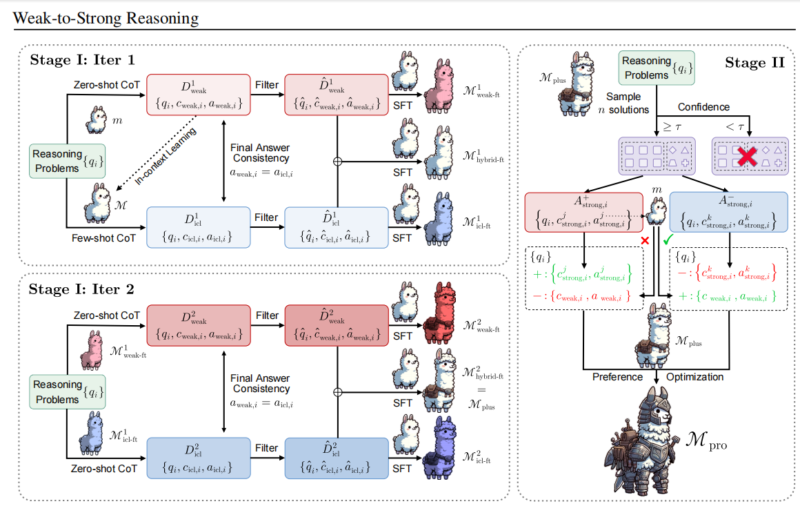
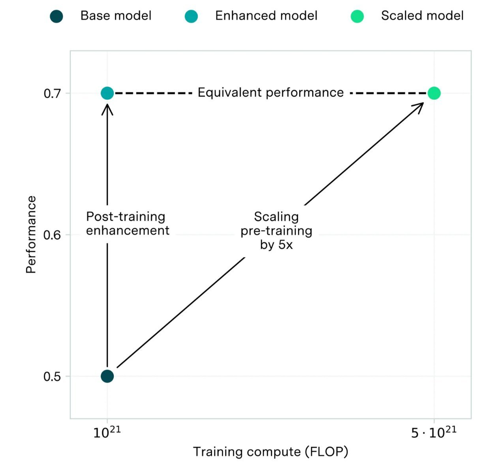

# paper
## weak-to-strong reasoning

### 名词
1. weak-to-strong learning
weak-to-strong learning paradigm (Burns et al., 2023), which operates under a unique task setting where only a less
capable model and a stronger but not fully utilized model are available.

### 知识
1. a model can enhance its capabilities more effectively by initially focusing on smaller, more reliable subsets of data, and then iteratively expanding its learning scope
2. generic supervised learning 指带label的sft
3. distillation based learning 指从强模型中distill知识的framework
4. self improvement learning 使用self generated data并加以过滤来进行训练
5. weak-to-strong learning 在模型能力远超人类的领域,很难再提供有效的监督,所以考虑使用弱模型来对强模型进行监督的方法
### 实验结论
1. full weak fine-tunning 对于分类任务很可以,但对于复杂的推理任务不太行
2. 本篇论文的方法效果很好(在reasoning 方面)

### Method
#### stage 1 : learning from Positive samples
- full weak fine-tuning
#### stage 2 : Learn from “Negative” Samples
- 把stage 1得到的最后一个模型作为M_{plus}
- 对于chosen和rejected pair的构造,需要注意的点是对于一个问题,假设弱模型的回答是a_{weak},强模型认可的答案是a_{strong}^+ , 不认可的答案是a_{weak}^-,如果a_{weak}与a_{strong}^+相同,则把a_{weak}和strong-作为pair,反之则把strong+和weak作为pair

#### stage 2

### 数据集
常用的数学数据集 GSM8K 和MATH 

## WEAK-TO-STRONG GENERALIZATION: ELICITING STRONG CAPABILITIES WITH WEAK SUPERVISION
### 论文目的
This gives us hope that the strong model can generalize beyond the weak supervision,solving even hard problems for which the weak supervisor can only give incomplete or flawed training labels. We call this phenomenon weak-to-strong generalization.

### Method
1. Create the weak supervisor 
用ground truth训练一个weak model
2. train a strong model with weak supervision
用weak model造一批数据用于训练强模型
3. train a strong model with ground truth as a ceiling 
作为对比,基于ground truth训练一个强模型

### 论文结论
验证了用弱模型监督强模型的可行性,进一步说明将来监督superhuman model的可行性

### experiments

## Reward bench
### 论文成果
1. 完成了一个评估reward model 的framework
2. Illustrate the differences between DPO and classifier-based reward models across a variety of datasets

### rewardbench
1. 基本的结构式有很多prompt-two_cmpletions pair,每个pair都由chosen和rejected组成,RM选择chosen则视为win
2. dataset由五个部分组成
- Chat : 检测模型对于open-ended generation的评判能力,使用AlpacaEval 和MT bench
- Chat Hard : 检测模型对于trick questions and subtly different instruction responses的评判能力
- Safety : 检测模型对危险内容的拒绝能力
- Reasoning : 检测模型对优质code的辨别能力
- Prior Sets : 很多数据集的总和（最后计算score时,该数据集的权重是其余数据集权重的一半,因为noise,lack of clearly defined tasks 等原因）
### evaluation results

# code

# blog
1. 
2. post-training 是相对于scale而言的,后者是预训练过程,而前者是诸如RLHF这类的在基础模型基础上做的训练
