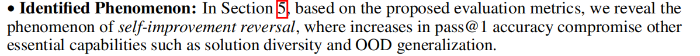
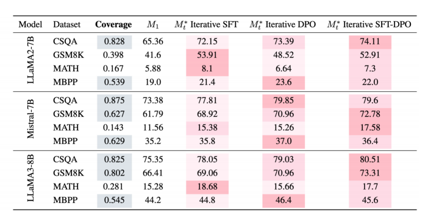
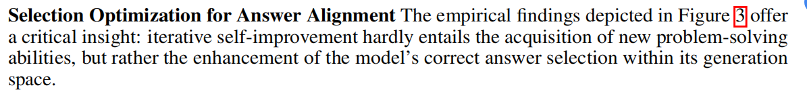
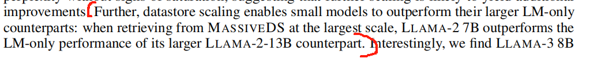

# paper
## RewardBench (具体内容写在day14了)

## progess or regress(self-improvement)
### 概念
1. self-improvement属于post-training

### 论文重点
虽然self-improvement可以有效提升模型的性能,但是对于其机制的一个综合理解还比较缺乏,本篇论文就是针对这个目标展开的
- systematic analusis : 对self-improvement的系统性分析
- metric innovation : 提出了评估self-improvement效果的一个framework
- Identified phenomenon: 

### method
1. 把影响因素划分为 initial model,taks dataset, the number of iterations , the specific post-training method
2. 方法就是对各种self-improvement的paradigm来做消融实验
### Experiment
#### setup
1. dataset:
- CSQA: general knowledge 
- GSM8K and MATH : mathematical reasoning 
- MBPP: code generation

#### main results
1. Iteration T pass@1逐步上升,并趋于平缓,说明现在的方法还不支持长期提升
2. Foundation model,problem-solving tasks,以及post-training methods 都呈现出任务导向性，即任务类型对pass@1的影响较大

#### Critical evaluation
1. 
2. 除了纯dpo的方法,在accuracy提升的同时diversity出现了下降
3. OOD Generalization

## Scaling Retrieval-Based Language Models
### 论文创新点
1. 如今的scaling laws可以被视为是预训练数据大小和模型参数数量的函数,本篇论文考虑了另外一个维度:datastore used at inference time by retrieval-based LMs
2. 构造了MassiveDS这一datastore
### 知识
1. Retrieval-based LMs : 提供一个知识库，在模型生成答案前可以根据输入从知识库中进行信息检索的模型(如RAG)
### 实验结论
1.  
2. Datastore scaling improves performance on several downstream tasks, and the degree of improvement is task-dependent.
# code
1. 后续要尝试一下llama2-7b

## Reliable, Adaptable, and Attributable Language Models with Retrieval（一篇对retrieval model的综述）

# blog 
## reward model
需要最大化$\log(\sigma(r_{\theta}(x,y_w)-r_{\theta}(x,y_l)))$

# X
1. NuminaMath dataset : 

2. 