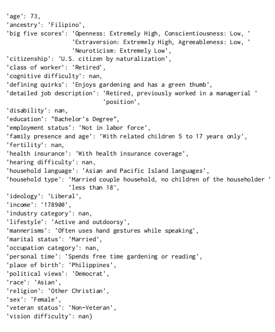
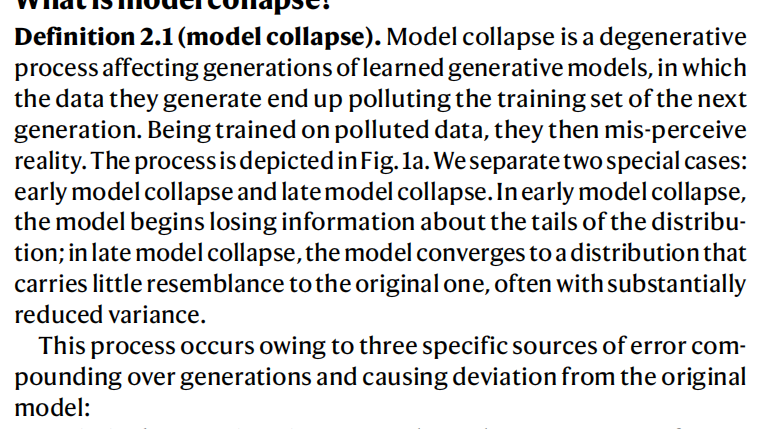

# paper
## PERSONA: A Reproducible Testbed for Pluralistic Alignment
### 问题
如今的RLHF方法侧重于选择"representative" user,这可能会导致模型在意见方面更加趋向于主流,而失去opinion的多样性
### 论文创新点
如今对于preference的evaluation仍然存在问题,无法精确到specific user,论文提出了PERSONA架构来解决这一问题(采用合成数据)
### Method
#### Creating a Demographic of Personas
1. 有一种方法是通过attribute tag来认为是赋予了模型性格,可以来自真实数据,也可以用GPT-4来进行合成

#### preference dataset construction

## AI models collapse when trained on recursively generated data (Nature)
### model collapse

### 导致collapse的原因
- Statistical approximation error
不断迭代是生成的数据会有一定程度的信息丢失
- Functional expressivity error
模型自身参数量或者说架构存在局限性
- Functional approximation error
训练方法无法将参数更新到最优
### method
1. 使用finetune来代替从头开始train模型来验证这一现象

# code
1. tar指令压缩后可以减小scp需要传输的内容大小