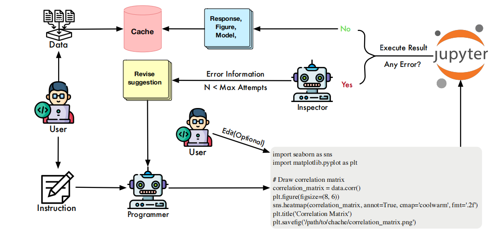
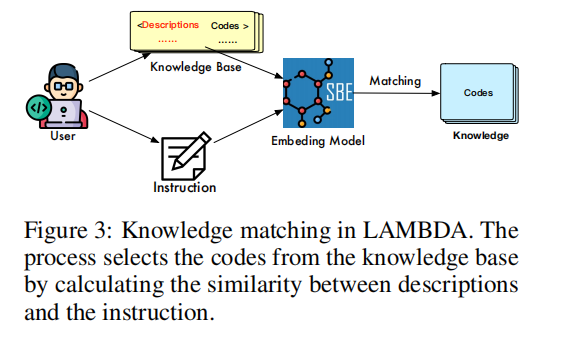

# paper
## LAMBDA: A Large Model Based Data Agent
### Method

(感觉这个framework也没有什么特殊之处?而且这个图里的知识库似乎与agent的行为完全脱节了?)

### 知识
The KV knowledge base is a repository for housing external resources from users in key and value pairs

# code
终于把数据迁移到a800了