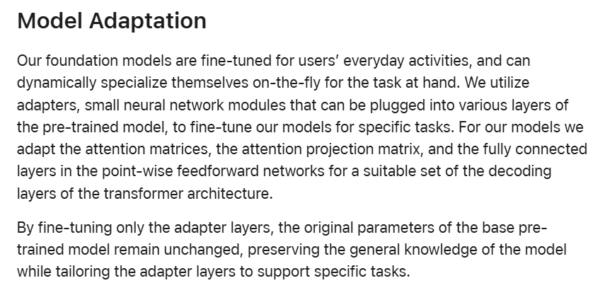

# paper
## Introducing Apple’s On-Device and Server Foundation Models
网址 https://machinelearning.apple.com/research/introducing-apple-foundation-models
### foundation models
1. 3B on device LM
2. 70B server-based LLM
### pre-training

### post-training
- a rejection sampling fine-tuning algorithm with teacher committee
- a reinforcement learning from human feedback (RLHF) algorithm with mirror descent policy optimization and a leave-one-out advantage estimator

### model adapter

# code

1. 不同的指标 (衡量conversation diversity的指标)
2. 泛化（模型直接迁移）+不泛化（在不同任务上直接去tune） 2.5
3. qa数据集更多一些 1 
4. 接具身的场景 2 (task diverse) https://github.com/MandiZhao/robot-collab
5. 迭代（脚本） 1.5
6. baseline : CoT+self-consistance(问题在于不好single)