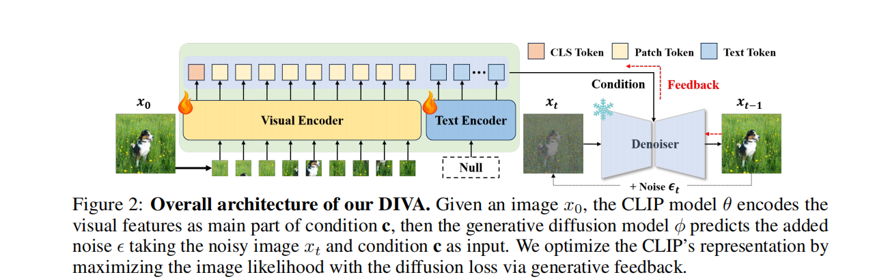

# paper
## DIFFUSION FEEDBACK HELPS CLIP SEE BETTER
### 知识
1. Contrastive language-image pre-training (CLIP) 
是一种text,image多模态的架构
解释博客 https://blog.csdn.net/weixin_47228643/article/details/136690837
（感觉训练方法是天然适配分类任务的）
2. clip's visual deficiencies
### 论文工作
Thus, in this work, we focus on addressing CLIP’s inability to distinguish fine-grained visual details via self-supervised learning (SSL) paradigm.
1. 提出了一个名为Diva的架构用于增强clip的表现,是将clip和diffusion结合的一个架构
### Diva的架构

除了clip模型的参数,其余参数在训练过程中都被frozen掉了

# code
1. subprocess在使用conda时,要先source ~/.bashrc
2. pkill -f <进程名> 可以根据进程名来kill