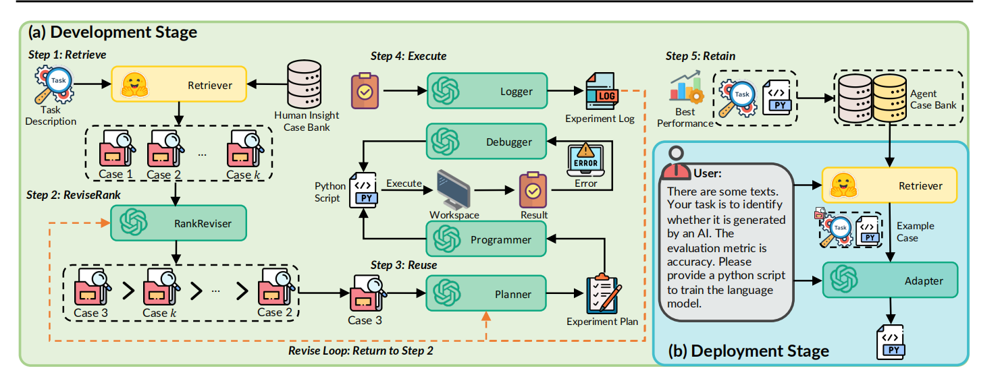
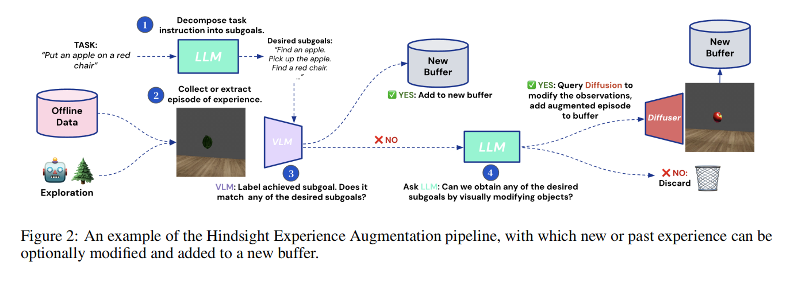
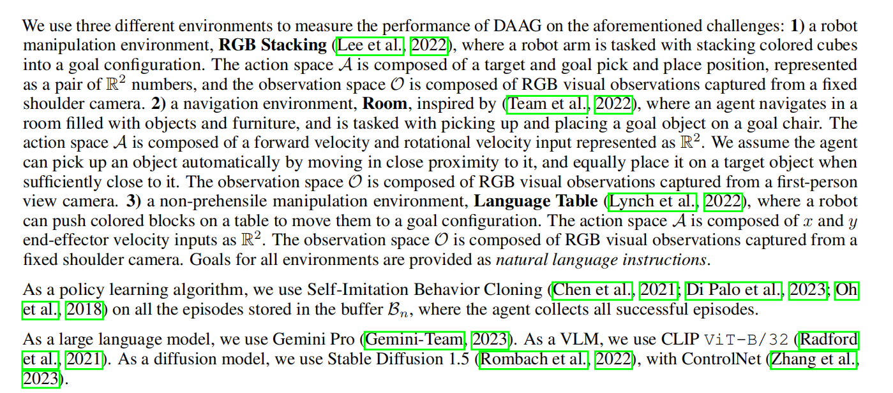

# paper
## DS-Agent: Automated Data Science by Empowering Large Language Models with Case-Based Reasoning
### 架构

感觉和day20里的Lambda有点像,甚至任务都是面向写代码的,代码和retriever似乎有着比较好的向性.
## diffusion augmented(增强的,拓展的) agent
### 思想
由于具身场景下RL可以获取到的数据很有限,所以考虑使用diffusion model来根据agent的trajectory来造“虚假”经历

### Method
#### "虚假"经历的pipline

#### lifelong learning
1. 对没有见过任务的学习:
 In DAAG, we aim to maximise the number of episodes from which the agent can learn to tackle a new task, even if it does not achieve any of the desired subgoals.
### experiment
#### setting

# blog
## 用RL解决现实场景的问题:stochasticity,scale,GAE与curriculum learning
https://zhuanlan.zhihu.com/p/704782858?utm_campaign=shareopn&utm_content=group3_article&utm_medium=social&utm_psn=1788511090986070016&utm_source=wechat_session
### 知识
1. Curriculum : 指的是模型训练过程需要从容易的任务开始过渡到更难的任务,这与人类课程学习类似
## GAE
https://zhuanlan.zhihu.com/p/45107835

# code