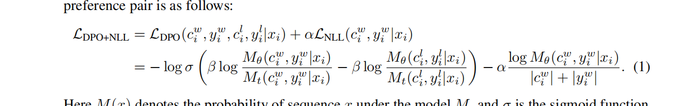

# paper
## Iterative Reasoning Preference Optimization
### Method
1. 数据收集部分
直接从模型的answer中sample并打分,组成chosen-rejected pair
2. 训练(主要是loss函数设计)

感觉本质上像是同时进行了dpo和sft

# code
1. https://huggingface.co/datasets/cam-cst/cbt?row=64  CBT
2. https://huggingface.co/datasets/mandarjoshi/trivia_qa?row=8  Trivia_qa
3. https://huggingface.co/datasets/nikhilweee/sharc_modified   sharc