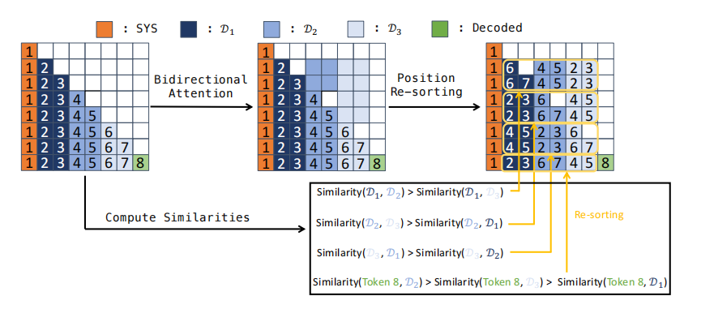
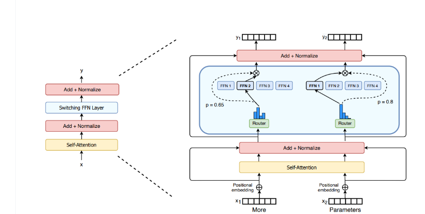
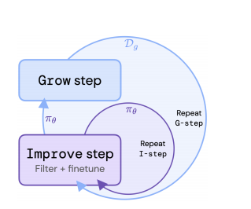

# paper
## position bias
### 什么是position bias
模型根据位置来prioritize content 导致的bias
### 论文创新:PINE用于消除position bias

#### bidirectional attention 和 position  re-sorting

把输入分成不同的trunk,trunk内部采用cauasl的mask方式,而不同trunk之间恒定可见.对于当前的token，永远当做最后一个,也即图中的index为6,然后其余可见token的index（代表位置信息）根据相似性来排序.

### Experiment
#### ablation study
上述两种方法的消融对比,结论是re-sorting的效果不明显,但是trunk划分的作用显著.

### 数据集选择
RewardBench: 让模型从对一个问题的多个回答中选择出最优的那一个

## MoE : 就是一种对transformer的局部修改(以前看到过)

### MoE层
- 将原本transformer的FNN层替换为MoE层,MoE层的结构由路由网络和专家神经网络组成

- 稀疏性
指的是对于一次输入，并不需要使用模型中所有参数的性质,显然MoE具有这个性质
- 稀疏性导致的问题
1. 训练时可能存在某些专家神经网络无法得到充分的训练

## Rest

### pipline
#### Grow (造数据)
- 就是用最新的策略造一批数据然后按照打分排序
#### Improve (训练)
- 用分数高出设定阈值的数据做sft,实现上的细节为：阈值不断提升，训练时的学习率需要逐渐下降.
- 但loss的设计好像比较复杂?

## Rest的改进:Beyond Human Data: Scaling Self-Training for Problem-Solving with Language Models ($Rest^{EM}$)
### pipline
<!-- #### Generate(E-step) -->
主要是一点区别,就是EM的Improve阶段都是从basemodel开始的,除此之外,这篇paper主要做的工作是从数学上尝试解释Rest的合理性