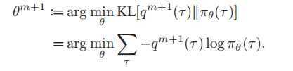

# paper
## AgentGYM

### 论文成果
#### 一个agent的平台agentGYM
#### AgentEvol
- BC利用专家数据来让模型具备一定的能力
- Evolution through exploration and learning
使用RL来应对该场景比较好
- pipline的数学原理
1. exploration step
这一步将RL视作是一个inference的任务,设计了q作为参数,这一步代表的含义为评估当前策略能够导向成功地可能性,并更新q来最大化可能性
2. learning step
这一步是更新策略
3. 综合起来两步主要更新的公式为

感觉有点像想办法让$\pi$往新更新的q上去靠的意思
- pipline的实现方案
- exploration step
感觉和上面的数学原理基本无关,就是造数据加打分,然后把所有的数据都汇总在一块
- learning step
使用数据集从initial开始训练(RL?SFT?),感觉他的损失函数逻辑是打分高的对loss的贡献大,更像是一种SFT
### experimental
#### tasks
webshop,ALFworld,SciWorld,BabyAI,TextCraft,BIRD,MAZE,Wordle,Tool-TODOList,Tool-Weather,Tool-Movie
#### 模型选择
选择了主流的cloesd-source和open-source模型
## Planetarium A Rigorous Benchmark for Translating Text to Structured Planning Languages
提出了一种评估PDDL code结构化语言的评估标准
### PDDL
一种古早的AI交流用语,是格式化的

### 论文工作
#### Rigorous Evaluation of Equivalence
同构图的方法
#### Benchmark data for PDDL Generation
造了一批benchmark的数据
#### Broad Evaluation of current LLMS
实验
### evaluation framework
数据预处理+检验是否同构
感觉更像是一个code generation 的任务,和结构化的语言交流关系不大.

## Moblie LLM
首先需要意识到,对于移动设备而言,由于其主存等限制,机载的大模型不能有过大的参数量,此篇论文都是基于1B以下的模型来展开的
### 论文结论
1. 对于小模型而言,深度往往比宽度更重要(这个我倒是验证过)
2. 通过参数共享来提升参数利用率
3. 设计出一个叫做MoblieLLM的模型结构
4. 做了硬件上的优化来提速()

# twitter
1. Shoutout to the team that built https://artificialanalysis.ai . Really neat site that benchmarks the speed of different LLM API providers to help developers pick which models to use. This nicely complements the LMSYS Chatbot Arena, Hugging Face open LLM leaderboards and Stanford's HELM that focus more on the quality of the outputs. 

I hope benchmarks like this encourage more providers to work on fast token generation, which is critical for agentic workflows!

2. All that really matters is, is 4bit 70b better than fp16 14b? The answer is almost always yes assuming the same training  (可能只是一种基于实验的感觉?)
