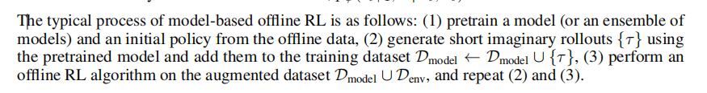
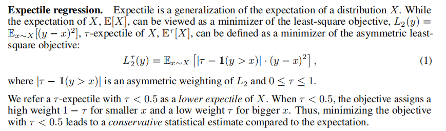
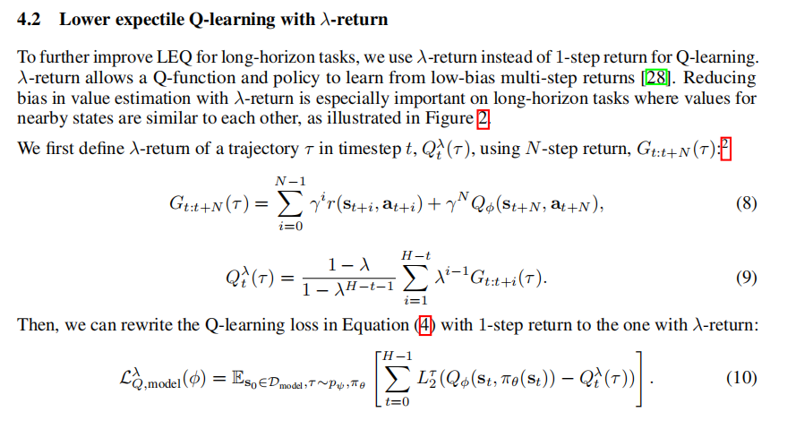

# paper
## (LEQ)Tackling Long-Horizon Tasks with Model-based Offline Reinforcement Learning

### 几个术语
1. model-free offline RL : 就是常见的只使用现有数据来进行训练的offline  , 存在out of distribution的问题
2. model-based offline RL : 训练一个world model,然后用该world model 来模拟轨迹和状态的变化,并把这产生的这部分数据混合到初始数据中,存在准确性问题

3. Expectile regression 

4.  conservative value function(感觉是这篇论文的核心方法了,实现long-horizon的方法基本都是实现conservative)
是对价值函数的一种改进,其主要逻辑为防止在某些特定情况下reward过大而导致模型倾向于冒险或者reward hacking
### 论文创新点 （我怎么感觉不像是一个Deep RL的架构）
提出了LEQ这个model-based offline RL的方法,来解决model-based的RL无法很好地解决long-horizon tasks的问题
#### $\lambda$ - return
相对于1-step return而言的,简单来说就是模拟多步以后再返回Q值用于更新

#### expanding dataset
一个问题是如果策略本身是收敛的,那么生成的state轨迹可能也是收敛的,一个解决此问题的方法是在原策略上加上一个正态分布的噪声来增加一些随机性,避免过快收敛

## Evaluating Language Model Context Windows: A “Working Memory” Test and Inference-time Correction

### 长文本处理存在的一些问题
1. 尽管现在的很多大模型可以接受很长的context,但仍无法确定其是否可以有效利用到长文本中的信息
2. lost-in-the-middle effect
即模型可能对于文本中间的内容会比较忽略
### 一些术语
1. “needle in a haystack”test

### 论文创新点
提出了一个用于评估长文本能力的framework SWiM

### SWiM的pipline
1. task generation
把context给一个LLM，然后让他帮忙生成一个QA pair用于后续评估
2. task validation 
人来评估问题的质量
3. task completion

4. task evaluation
让LLM评估response

### Medoid Voting: a simple solution to lost-in-the-middle effect

为了解决position的问题,本篇论文对于同一个问题把文档进行排序来让模型回答多次,通过投票的方式来决定出最终的答案(感觉拓展性不是很高,除非说能找到除了投票以外的其他评估方式,不然对于开放性的问题可能不会起作用)

### 实验
1. 测试了position和context size 的影响

# lecture(Scaling law and **pretrain data**)
1. common crawl
2. 小模型是怎么update的?
3. reference task?(疑似是选择数据集？)
