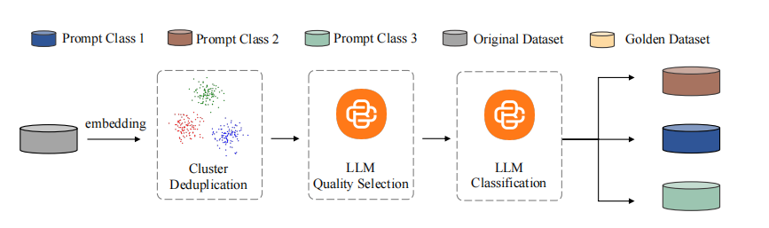

# paper
## Vision language models are blind
一篇实验论文
### 发现
1. VLM 无法很好地判断两条线是否相交 , 这与VLM在很多QA问题上的良好表现似乎有点相悖,这个结果说明目前阶段的VLM相比于关注十分精细的细节,更会关注一些大局上的东西
2. 无法很精确地给出被circle的word
3. 数相交圆等形状中，单位形状的数量任务(有趣的是,对于数圆,模型对于5个圆的情况有着100%的正确率,其余情况正确率则不到50%,这显然是由于Olympics logo 带来的bias导致的)
4. 无法精确地数清楚网格的行列数
5. 无法精确地给出地铁线的数量
## PAS: Data-Efficient Plug-and-Play Prompt Augmentation System

属于prompt engineering的范畴

### Method
#### prompts Data Collection
使用数据集 LMSYS-1M , WildChat

每一步都使用一个较为专门的模型完成
#### prompts augumentation dataset(增强数据集)
本质是用few-shot的方法让模型进行data的diverse

####  Automatic Prompt Complementary Plug-and-Play System PAS
使用上面收集到的数据集sft一个LLM,这个模型就叫PAS,对于我们手写的prompt,可以让这个模型帮助做一些补充从而达到一个更好的效果.

### Experiment
#### 数据集
Arena-hard 是用来测试LLM在解决复杂问题时的鲁棒性的benchark
Alpaca-Eval 2.0

# code

## logit 使用
明确模型训练时要学的东西是什么,模型不需要学chat_template,template仅仅是作为一个prompt,简单来说
模型inference时需要看到template,但是模型不需要学习输出它们(除了eos),所以我们计算loss的时候不应该把
template的部分也纳入进来,否则会导致平均的loss过大,同时还需要注意loss计算时需要把padding排除在外.

## 基本pipline完成了