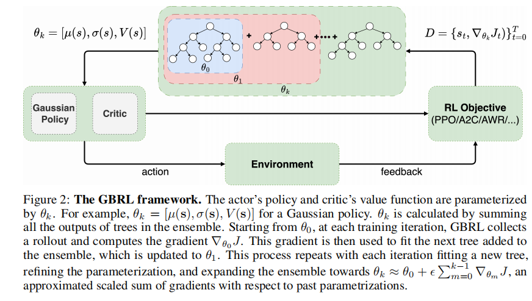
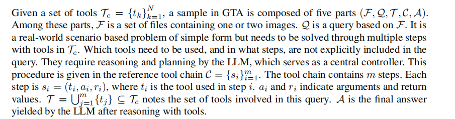
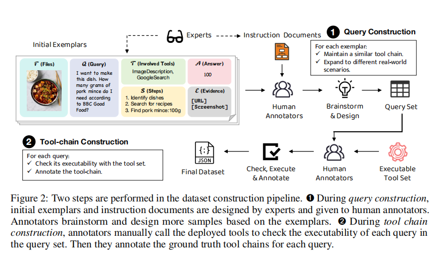
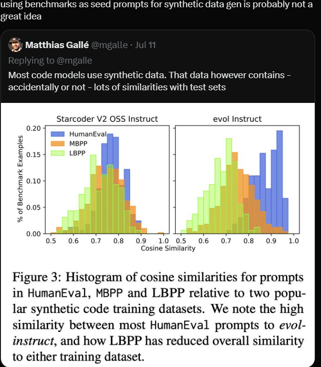

# paper

## Gradient Boosting Reinforcement Learning
### 论文创新点
提出了一种叫做GBRL的方法,将RL和GBT(Gradient boosting tree)结合起来

### 一些观点
1. GBT一直没有RL变体的原因是:Despite their successes, GBT has seen limited application in RL. This is primarily because traditional GBT libraries are designed for static datasets with predefined labels, contrasting with the dynamic nature of RL

### 一些术语
1. Gaussian policy
要求NN(本篇为GBT)输出一个$[\mu(s),\sigma(s)]$向量,然后在分布$N(\mu(s),\sigma(s))$上采样得到action

### Method

### 实验结果
在一些分类任务上可以超越NN，但是在大多数情况下感觉还是不如NN的效果来得好

##  GTA: A Benchmark for General Tool Agents

### GTA 的一些特点
1. Real user queries 
queries数据集由人类设计,任务描述清晰但是不包含步骤规划信息,同时需要多步才可以解决

2. Real deployed tools
每一步都调用了具体的tool

3. Real multimodal inputs
采用多模态的输入来尽可能地模拟真实的世界

### 关于tool-use evaluation
1. 一些指标: pass rate , win rate

### GTA benchmark
#### dataset formulation

基本就是全靠人来完成整个数据集的构建的

### 实验的一些情况
1. 实验时采用了ReaCt的prompt模板
2. 实验结果表明模型调用工具时出的错误具有偏好性(?那是否可以引入类似投票机制的方法来增强Group调用工具的准确性)

## MultiImage

### 数据集
论文造了一个Multi-image,Multi-frame,multi-view的数据集M4-Instruct

## IOA

### 一些术语
1. semantic matching techniques
用于计算词之间相似度的算法,可能是一些直接计算值的算法,也会有一些机器学习算法

2. 

# diffusion model
好博客: https://blog.csdn.net/DFCED/article/details/132394895#:~:text=Diffusion%20Models%20%E6%97%A2%E7%84%B6%E5%8F%AB%E7%94%9F%E6%88%90%E6%A8%A1%E5%9E%8B%EF%BC%8C%E8%BF%99%E6%84%8F%E5%91%B3%E7%9D%80%20Diffusion%20Models

简单理解：
- 数据集构造: 逐步加入噪声,作为总的数据集(故diffussion模型的输入维度和隐层维度相等)
- 图片生成: 逐步去除噪声,这一步中有较多的数学证明与细节

#  twitter
1. 合成数据可能会对测试集有影响,所以需要注意sft时使用的数据集

2. 