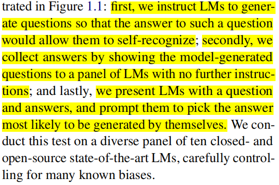
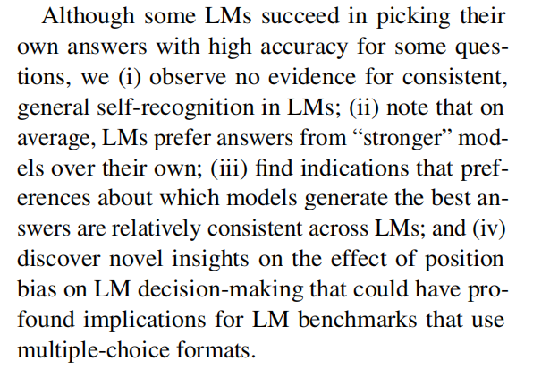
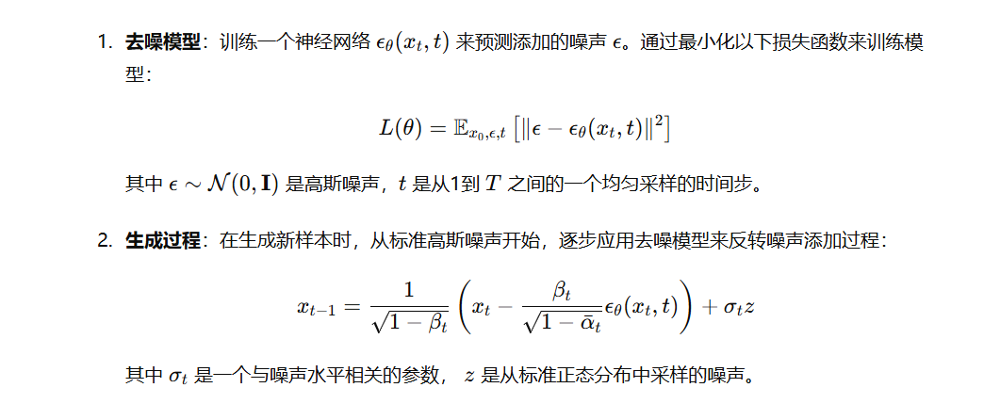

# paper

## self-recognition

### self recognition 带来的潜在安全性问题

1. . The moment one of the copies recognizes their sameness,
this knowledge can be abused to (i) simulate future interactions or (ii) attempt to deduce the other
side’s sensitive information based on past interactions (Morris et al., 2024)

### 论文工作

### 实验结论

## Video Diffusion Alignment via Reward Gradients

### 论文创新点
在diffussion模型的架构下引入了reward model(称为VADER)

### 知识
1. policy based的diffusion model的训练和inference过程

# code

1. scp -3r 可以支持在本地将服务器A的文件夹scp到服务器B,需要注意要使用wsl才可以正常运行

2. 试试tune完的inference,如果还可以则考虑用monte carlo树造一批数据出来,调试dpo训练的pipline

